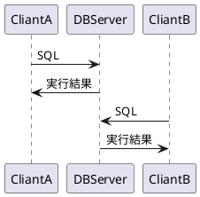
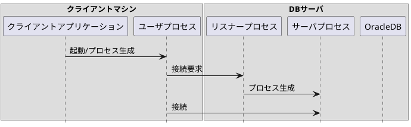
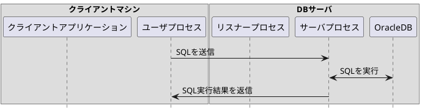
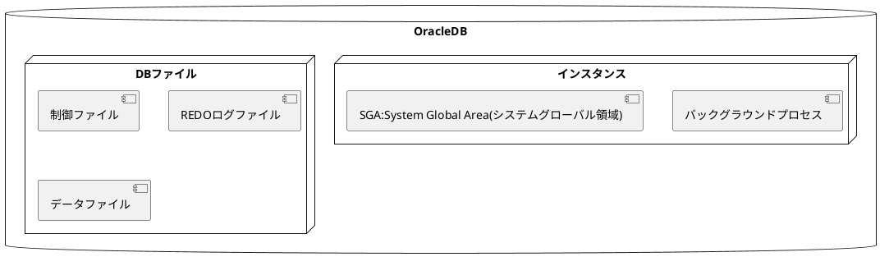

# 1.Oracleデータベース管理の概要

## 1.データベースの基礎知識

### 1.データベースとは

* DB：特定の目的に必要な**データ**を利用しやすく整理、保管したもの

* ex1:レストランのメニューのデータ

| 料理名    | 価格  |
|--------|-----|
| ナポリタン  | 700 |
| カルボナーラ | 800 |
| ビーフカレー | 800 |
| チキンカレー | 750 | 
| チキンドリア | 900 | 

* ex2:レストランの注文履歴のデータ

| 注文ID    | 注文日時               | 料理名    | 数量  |
|---------|--------------------|--------|-----|
| 19-0001 | 2019/9/20 19:45:00 | ナポリタン  | 2   |
| 19-0002 | 2019/9/20 19:47:00 | チキンドリア | 1   |
| 19-0003 | 2019/9/20 19:48:00 | ビーフカレー | 1   |
| 19-0004 | 2019/9/20 19:48:00 | ビーフカレー | 2   |

#### DBMS：DatabaseManagementSystem
* DBの構築、運用専用のソフトウェア
* OracleDatabaseもDBMSの1つ

#### DBが備えるべき要件
* 大量のデータを管理できる
* 複数の利用者で共有、同時に利用できる
* データを高速に参照、変更できる。パフォーマンス良。
* データの破損、障害発生したりしたときも、速やかに復旧できる（可用性）

### 2.リレーショナルデータベース
* データを形式で整理したデータベースのこと
* 現在の主流
* リレーショナルデータベースを構築、管理するためのDBMSを**RDBMS**って言う
  * OracleはDBMSであり、RDBMSでもある
* リレーショナルじゃない、階層型DBや、ネットワーク型DBもあるらしいよ

#### 表、列、行
* 表：テーブル
  * データを格納するところ
* 行：レコード
* 列：カラム
  * カラム名とデータ型を指定する

## 2.SQLの基礎知識
### 1.SQLとは
* データベースの表に格納されたデータの参照、変更を行うための言語
* ANSI(アメリカ規格協会)とか、ISO(国際標準化機構)やらによって標準規格が定められてる
* Oracleも含めて大体のRDBMSは標準規格に準拠しているから、異なるRDBMSでも同じSQLを使用できるよ
  * SQLはDBにおける共通言語である、とも言えるよ
  * 方言的に、細部が異なる部分もあるよ
* 5種類の命令に分けられるよ

#### データ検索
* SELECT:表に格納された行の参照（問い合わせ、検索）

#### DML:データ操作言語(Data Manipulation Language)
* INSERT:表への行の追加（挿入）
* UPDATE:表に格納された行の更新
* DELETE:表に格納された行の削除

#### DDL:データ定義言語(Data Definition Language)
* CREATE:オブジェクトの作成
* DROP:オブジェクトの削除
* ALTER:オブジェクトの定義変更
* TRUNCATE:表に格納された全ての行を一括削除

#### トランザクション制御
* COMMIT:トランザクションの確定
* ROLLBACK:トランザクションの取り消し

#### DCL:データ制御言語(Data Control Language)
* GRANT:権限の付与
* REVOKE:権限の取り消し（剥奪）

#### トランザクション制御について
* 中途半端な状態になることを防止するシステム
  * 複数のSQL文を1つの塊＝トランザクションとみなす
  * トランザクションに含まれるSQL文のうち、どれか1つでも失敗した場合、トランザクション全体が失敗したとみなす
    * 失敗した際は、トランザクションで実行した処理を全て取り消し、トランザクション実行前の状態に戻す
  * トランザクションに含まれるSQL文の全てが成功したら、トランザクションが成功したとみなす
    * その後、トランザクションを確定してはじめてSQL文の結果が反映される
  * この性質を、トランザクションの**原子性:Atomicity**と呼ぶ
* 暗黙のコミット
  * トランザクション実行中に、確定：コミットしていないにも関わらず、DDLコマンドを実行すると、そのDDLコマンド前に実行されていたトランザクションが確定される
  * 明示的にCOMMITコマンドを実行していないにも関わらず、トランザクションがコミットされる動作のこと

## 3.Oracleデータベースの概要
### 1.クライアント/サーバシステム

* DBが備えるべき要件の1つでもある「データを複数の利用者で共有し、同時に利用できる」点を実現するため
* DBサーバにOracleをインストールし、クライアントマシンからネットワークを介して同時に利用できる構成

### 2.Oracleを利用する流れ
1. Oracleソフトウェアをインストールする
2. OracleDBを作成する
3. アプリケーション用のユーザを作成する
4. ユーザに権限を付与する
5. 表を作る、データを読み書きする

### 3.OracleDB管理者のタスク
#### セットアップ
* Oracleソフトウェアのインストール
* DBの作成
* Oracle Network環境の構成
#### 日常的な業務
* リスナーの管理（起動、停止）
* インスタンスの管理（起動、停止）
* 表領域の管理
* ユーザの管理
* スキーマオブジェクトの管理
* データのロード
#### 障害対策
* パフォーマンスの監視
* バックアップとリカバリの実行

### 4.DB管理ツール
#### DBCA:Oracle Database Configuration Assistant
* DBの作成、削除およびテンプレートの管理
#### OUI:Oracle Universal Installer
* Oracleソフトウェアのインストール、アンインストール
#### DBUA:Database Upgrade Assistant
* 古いリリースのDBを新しいリリースにアップグレード
#### EM Express:Oracle Enterprise Manager Database Express
* WebブラウザからGUI操作でOracleDBを操作可能
* パフォーマンス監視、構成管理、診断、チューニングetc
#### Cloud Control:Oracle Enterprise Manager Cloud Control
* WebブラウザからGUI操作で複数のOracleDBを一元的に管理可能。色々な作業可
#### SQL*PLUS
* CLIでSQLを実行してOracleDBを管理
#### Oracle Net Manager
* Oracleをネットワーク環境で使用するための設定
* NetCAよりも広範な設定
#### NetCA
* Oracleをネットワーク環境で使用するための主要な設定
#### LSNRCTL:リスナー制御ユーティリティ
* リスナーの起動、停止
#### SQL*Loader
* CSVファイルetcのデータをDBのテーブルにロード
#### Oracle Data Pump
* DB内のデータを別のDBに転送
#### RMAN:Recovery Manager
* DBのバックアップ
* 障害発生時の復旧作業

## 4.OracleDBの基本的な動作と構造
### 1.SQLを実行する処理の流れ
* DBへの接続
1. SQL*Plus等のクライアントアプリケーションを起動すると、ユーザプロセス(クライアントプロセス)が生成される
2. ユーザプロセスがリスナープロセスに対し、DBにへの接続要求を送る
3. リスナープロセスは接続要求を受け取ると、サーバプロセスを生成する
4. 生成されたサーバプロセスは、ユーザプロセスと接続して、ユーザプロセスからの処理要求を待機する

* SQLの処理
1. ユーザプロセスがサーバプロセスにSQLを送信する
2. SQLを受け取ったサーバプロセスが、Oracle内部にアクセスしてSQLを実行
3. サーバプロセスが実行結果をユーザプロセスへ返信

### 2.OracleDBの内部構造
* インスタンス
  * Oracleの処理を行う常駐部分
  * インスタンスが起動していないとDBは処理を一切実行できない
  * SGAとバックグラウンドプロセスから構成される
* DBファイル
  * DBを構成するファイル群
  * ストレージ装置の記憶域に保存されている
  * DBファイル、REDOログファイル、制御ファイルから構成される
