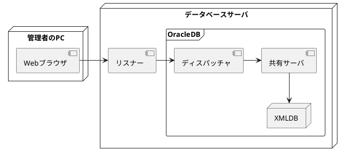

# 3.Oracle Enterprise Manager Database ExpressおよびSQL管理ツールの使用

## 1.Oracle Enterprise Manager Database Express

### 1.Oracle Enterprise Manager Database Expressとは

* 略称：EM Express
* WebブラウザからGUIでOracleDBの管理作業を行えるツール
    * GUIだから操作簡単
* Oracleに標準添付
    * だから、導入しやすい
* 動作が軽量
* できること
    * パフォーマンスの監視
    * 構成管理
    * 診断
    * チューニングetc
* 内部的には、SQLに置き換えられてOracleに送信されてる

### 2.EM Expressのアーキテクチャ



* リスナー：ネットワーク経由の接続を中継する
* ディスパッチャ、共有サーバ：共有サーバ接続を可能にするOracleのコンポーネント
* XML DB機能：XML形式のデータをOracleDBで管理するためのコンポーネント
* Oracleに同梱されてるから追加インストールは原則不要
* EM Expressのコア部分はOracleDB内で動作する
  * EM ExpressはDBが起動していないと利用できない
    * **EM ExpressはDBを起動することはできない**

### 3.EM Expressの構成
* DB作成時にEM Expressを構成しなかった場合
* EM Expressが使用するポート番号を変更する場合等
1. リスナーが起動されていることを確認
2. DISPATCHERS初期パラメータに、PROTOCOL=TCPが含まれていることを確認
```
SQL> show parameter dispatchers

NAME            TYPE       VALUE
--------------- ---------- --------------------------------
dispatchers     string     (PROTOCOL=TCP)(SERVICE=orclXDB)
max_dispatchers integer
```
3. SHARED_SERVERS初期化パラメータがゼロより大きいことを確認
```
SQL> show parameter shared_servers

NAME               TYPE       VALUE
------------------ ---------- -----------
max_shared_servers integer    
shared_servers     integer    1
```
4. DBMS_XDB_CONFIG.SETHTTPSPORTプロシージャを実行して、EM ExpressのHTTPSポートを設定する
  同一DBサーバに複数のOracleDBがある場合は、それぞれに異なるポートを設定する
```
SQL> exec DBMS_CONFIG.SETHTTPSPORT(5500)

PL/SQLプロシージャが正常に完了しました。
```
5. EM ExpressのHTTPSポートを確認する
```
SQL> SELECT DBMS_XDB_CONFIG.GETHTTPSPORT FROM DUAL;

GETHTTPSPORT
------------
        5500
```
* EM ExpressのURL：https://<DBサーバのホスト名orIPアドレス>:<EM ExpressのHTTPSポート番号>/em

### 4.EM Expressのページ
* EM ExpressのURLを指定してWebブラウザでアクセスすると、ログインページが表示される
* OracleDBに組み込まれた軽量の管理ツール
* 少ないメモリとストレージ消費で動作する
* 対応している管理機能は、「構成」「記憶域」「セキュリティ」「パフォーマンス
* 起動や停止、バックアップ、リカバリといった機能は無い
* 下記作業を実行可能
  * 初期化パラメータの編集
  * 表領域の管理(作成、変更、削除)
  * UNDO管理(表領域の切り替え、分析パラメータの編集)
  * REDOログファイルの管理(追加、削除、多重化)
  * 制御ファイルの管理(トレースにバックアップ)
  * ユーザの管理(作成、変更、削除)
  * ロールの管理(作成、削除)
  * ADDMによって検出されたパフォーマンスの結果と推奨事項の表示
  * AWRに取得した統計の表示
  * SQLチューニングアドバイザの実行

### 5.EM ExpressとEnterprise Manager Cloud Control
* Enterprise Manager Cloud Controlは上位互換
* 複数のOracleDB、Oracle以外の製品を統合的に管理できる
* 管理対象サーバには、Oracle Management Agent(管理エージェント)を配置する必要がある
* 起動、停止を含め、原則ほぼ全ての管理作業を実行できる
* Cloud ControlはOracleDBとは別の独立した製品
* Cloud Controlでは下記作業が実行可能
  * インスタンス（DB）の起動/停止
  * スキーマ(表/索引など)の管理
  * ジョブの管理および実行
  * バックアップ/リカバリ
  * データベースリソースマネージャ
  * パッチ推奨(My Oracle Support パッチ取得)
  * 複数DBの統合管理

## 2.SQL*Plus
### 1.SQL*Plusとは
* CLIのDB管理ツール
* Oracleソフトウェアに含まれている
* SQL,PL/SQLコマンド、SQL*Plusコマンドを実行可能
  * PL/SQLコマンド：Oracle独自のプログラミング言語
    ```
    DECLARE
      n_count NUMBER := 100;
    BEGIN
      FOR i IN 1 .. n_count LOOP
        IF ( MOD(i,2) = 0) THEN
          INSERT INTO tbl01 (num,even) VALUES(i, '偶数');
        ELSE
          INSERT INTO tbl01 (num,even) VALUES(i, '奇数');
        END IF;
      END LOOP;
    END;
    ```
  
    * 下記3種類の使用形態
      * ストアドプログラム：名前をつけてPL/SQLプログラムをDBに保管し、繰り返し使用できるようにする
        * パッケージ、プロシージャ、ファンクションがある
      * トリガー：DML実行などの特定イベント発生時に、PL/SQLプログラムを実行する
      * 無名ブロック：一時的な用途でPL/SQLプログラムを実行する際に使用
  * SQL\*Plusコマンド：SQL\*Plusの実行環境を設定するSQL\*Plusツール固有のコマンド

### 2.SQL*Plusの起動と接続
* ターミナルでsqlplusコマンドを実行する
```
$ sqlplus

SQL*Plus: Release 19.0.0.0.0 - Production on 日 3月 1 01:49:49:49 2020
Version 19.3.0.0.0

Copyright (c) 1982, 2019, Oracle. All rights reserved.

ユーザー名を入力してください: system
パスワードを入力してください:
最終正常ログイン日時: 日 3月 01 2020 01:49:40 +00:00


Oracle Database 19c Enterprise Edition Release 19.0.0.0.0 - Production 
Version 19.3.0.0.0
に接続されました。
SQL>
```
* ユーザ名の大文字小文字は**区別されない**
* パスワードの大文字小文字は**区別される**
* 起動時にユーザ名、パ数アードを指定することも可能
  * `sqlplus <ユーザ名>/<パスワード>`
* /nolog：SQL*Plus起動時にOracleDBに接続しないオプション
  * CONNECTコマンドでDBに接続できる
  * `CONNECT <ユーザ名>/<パスワード>`
### 3.SYSユーザでの接続とAS SYSDBAオプション
* SYSユーザで接続する場合に必要なオプション
* `Sqlplus <SYSユーザ名>/<パスワード> as sysdba`
* Oracleのインストール作業を実行したOSユーザでOSにログインしている場合、ユーザ名/パスワードを省略できる
  * **OS認証**
### 4.SQL*Plusの使い方
* 対話モード
  * `SQL>`でプロンプトに直接コマンドを入力、実行する
* バッチモード
  * コマンドをファイルに記述して、ファイルごとまとめて実行する
#### HOSTコマンド
  * SQLコマンドではなく、SQL*Plusコマンド
  * SQL*Plus内でOSコマンドを実行できる