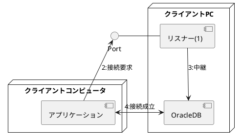

# 4.Oracle Network環境の構成

## 1.OracleDBへ接続するソフトウェア
### 1.Oracle Net
* クライアントコンピュータとDBサーバで必要な作業
  * クライアントコンピュータ
    * Oracleクライアントのインストール(BronzeDBA範囲外)
    * Oracle Netの構成
  * DBサーバ
    * Oracle Netの構成
* Oracle Netを用いてネットワーク環境でOracleDBに接続する主なシステム構成2種類
  * クライアント/サーバ型
    * クライアントPCで動作するアプリケーションが、クライアントとしてOracleDBに接続する
    * クライアントPCにOracleクライアントをインストールする必要がある
    ```puml
    @startuml
  
    title クライアント/サーバ型
    [使用者]
    node "クライアントPC"{
      [アプリケーション]
      [Oracleクライアント]
    }
    node "DBサーバ"{
        [OracleDB]
    }
  
    [使用者]-->[アプリケーション]
    [Oracleクライアント]<->[OracleDB]:OracleNetを用いて接続
    @enduml
    ```
  * Webアプリケーション型
    * Webアプリケーションサーバで動作するWebアプリケーションが、クライアントとしてOracleDBに接続
    * WebアプリケーションサーバにOracleクライアントをインストールする必要がある
    * 使用者が操作するWebクライアント端末でWebブラウザを起動、Webアプリケーションにアクセスする

    ```puml
    @startuml
  
    title Webアプリケーション型
    [使用者]
    node "Webクライアント端末"{
    [Webブラウザ]
    }
    node "クライアントPC"{
      [Oracleクライアント]
      [Webアプリケーション]
    }
    node "DBサーバ"{
        [OracleDB]
    }
  
    [使用者]-->[Webブラウザ]
    [Webブラウザ]<-->[Webアプリケーション]:通信
    [Oracleクライアント]<->[OracleDB]:OracleNetを用いて接続
    @enduml
    ```
### 2.リモート接続の全体像
* リモート接続：クライアントがネットワークを介してOracleDBに接続すること
  * 1:DBサーバでリスナー起動
    * リスナーは指定されたポート番号で接続要求を待つ
      * デフォルトポート番号：1521
    * OracleDBに中継する役割を持つ
  * 2:クライアントがリスナーに接続要求送信
    * 送信先：DBサーバのホスト名とリスナーのポート番号
  * 3:接続要求を受けたリスナーは、クライアントが指定したDBサービス名に対応するOracleDBに接続を中継する
  * 4:リスナーが中継後、裏慰安ととOracleDBの接続が確率される


### 3.OracleNetの構成を支援するツール
* listener.ora,tnsnames.ora等の設定ファイルに記載する
* 下記管理ツールを用いてGUIでの設定が可能
  * Oracle Net Manager(NETMGR,Net Manager)
  * Oracle Net COnfiguration Assistant(NetCA)
  * Oracle Enterprise Manager Cloud Control

## 2.リスナーの起動/停止と設定
### 1.リスナーとは
* インスタンスとは別のプロセス
* * DBサーバで動作する
* インスタンスを起動してもリスナーは起動しない
  * リスナーが起動していない場合、ネットワーク経由でOracleDBに接続はできない
  * 同じDBサーバで動作する複数のOracleDBへの接続を受け付けることができる
* 接続要求を受付、接続要求をOracleDBに転送する役割を持つ

### 2.listener.oraによるリスナーの設定
* DBサーバ内の*listener.ora*に記載する
  * パス：<ORACLE_HOME>/network/admin/listener.ora
  * リスナー名、DBサーバのホスト名、接続待受ポート番号etcを記載する

### 3.リスナー制御ユーティリティ(lsnrctl)を衣装した管理
* lsnrctl:リスナーコントロール。リスナー制御ユーティリティ
  * ターミナル上で使うCLIのツール
  * 
## 3.クライアントからの接続
### 1.リモート接続と接続識別子
### 2.ネーミングメソッド
### 3.簡易接続ネーミング
### 4.ローカルネーミング
