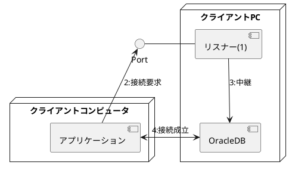

# 4.Oracle Network環境の構成

## 1.OracleDBへ接続するソフトウェア
### 1.Oracle Net
* クライアントコンピュータとDBサーバで必要な作業
  * クライアントコンピュータ
    * Oracleクライアントのインストール(BronzeDBA範囲外)
    * Oracle Netの構成
  * DBサーバ
    * Oracle Netの構成
* Oracle Netを用いてネットワーク環境でOracleDBに接続する主なシステム構成2種類
  * クライアント/サーバ型
    * クライアントPCで動作するアプリケーションが、クライアントとしてOracleDBに接続する
    * クライアントPCにOracleクライアントをインストールする必要がある
    ```puml
    @startuml
  
    title クライアント/サーバ型
    [使用者]
    node "クライアントPC"{
      [アプリケーション]
      [Oracleクライアント]
    }
    node "DBサーバ"{
        [OracleDB]
    }
  
    [使用者]-->[アプリケーション]
    [Oracleクライアント]<->[OracleDB]:OracleNetを用いて接続
    @enduml
    ```
  * Webアプリケーション型
    * Webアプリケーションサーバで動作するWebアプリケーションが、クライアントとしてOracleDBに接続
    * WebアプリケーションサーバにOracleクライアントをインストールする必要がある
    * 使用者が操作するWebクライアント端末でWebブラウザを起動、Webアプリケーションにアクセスする

    ```puml
    @startuml
  
    title Webアプリケーション型
    [使用者]
    node "Webクライアント端末"{
    [Webブラウザ]
    }
    node "クライアントPC"{
      [Oracleクライアント]
      [Webアプリケーション]
    }
    node "DBサーバ"{
        [OracleDB]
    }
  
    [使用者]-->[Webブラウザ]
    [Webブラウザ]<-->[Webアプリケーション]:通信
    [Oracleクライアント]<->[OracleDB]:OracleNetを用いて接続
    @enduml
    ```
### 2.リモート接続の全体像
* リモート接続：クライアントがネットワークを介してOracleDBに接続すること
  * 1:DBサーバでリスナー起動
    * リスナーは指定されたポート番号で接続要求を待つ
      * デフォルトポート番号：1521
    * OracleDBに中継する役割を持つ
  * 2:クライアントがリスナーに接続要求送信
    * 送信先：DBサーバのホスト名とリスナーのポート番号
  * 3:接続要求を受けたリスナーは、クライアントが指定したDBサービス名に対応するOracleDBに接続を中継する
  * 4:リスナーが中継後、裏慰安ととOracleDBの接続が確率される


### 3.OracleNetの構成を支援するツール
* listener.ora,tnsnames.ora等の設定ファイルに記載する
* 下記管理ツールを用いてGUIでの設定が可能
  * Oracle Net Manager(NETMGR,Net Manager)
  * Oracle Net COnfiguration Assistant(NetCA)
  * Oracle Enterprise Manager Cloud Control

## 2.リスナーの起動/停止と設定
### 1.リスナーとは
* インスタンスとは別のプロセス
* * DBサーバで動作する
* インスタンスを起動してもリスナーは起動しない
  * リスナーが起動していない場合、ネットワーク経由でOracleDBに接続はできない
  * 同じDBサーバで動作する複数のOracleDBへの接続を受け付けることができる
* 接続要求を受付、接続要求をOracleDBに転送する役割を持つ

### 2.listener.oraによるリスナーの設定
* DBサーバ内の*listener.ora*に記載する
  * パス：<ORACLE_HOME>/network/admin/listener.ora
  * リスナー名、DBサーバのホスト名、接続待受ポート番号etcを記載する

### 3.リスナー制御ユーティリティ(lsnrctl)を衣装した管理
* lsnrctl:リスナーコントロール。リスナー制御ユーティリティ
  * ターミナル上で使うCLIのツール
  * リスナー名を省略した場合、制御対象は**LISTENER**となる
  * 起動、停止、サービスの情報確認が可能
    * lsnrctl start <リスナー名>:リスナーの起動
    * lsnrctl stop <リスナー名>:リスナーの停止
      * 停止したリスナーを介したOracleDBへの新規接続ができなくなる
      * 既に確立済みの接続には影響なし
    * lsnrctl status <リスナー名>:リスナーの稼働状態を確認
      * リスナーのプロトコル、ホスト名、ポート番号
      * ログファイルの出力先
      * リスナーに登録されているDBサービスのサマリー
    * lsnrctl services <リスナー名>:リスナーの稼働状態を確認
## 3.クライアントからの接続
### 1.リモート接続と接続識別子
* ローカル接続：`sqlplus <ユーザ名>/<パスワード>`
  * クライアントとOracleDBが同一マシン上にあり、ネットワークを介さない接続
  * OracleNetの構成は不要
  * ORACLE_SID環境変数に、接続先インスタンスのSIDを指定しておく必要がある
* リモート接続：`sqlplus <ユーザ名>/<パスワード>@<接続識別子>`
  * ネットワークを介してクライアントからOracleDBに接続
  * OracleNetの構成が必要
### 2.ネーミングメソッド
* 接続識別子を接続先情報に解決する方法(4種類)
  * 簡易接続ネーミング
    * 接続識別子に、接続先情報を直接指定する
  * ローカルネーミング
    * クライアントPC上の設定ファイル：tnsnames.oraから接続先情報を得る
  * ディレクトリネーミング
    * LDAP準拠のディレクトリサーバに接続識別子と接続先情報を記載しておき、ここから接続先情報を得る
  * 外部ネーミング
    * 外部ネーミングサービスに接続識別子と接続先情報を記載しておき、ここから接続先情報を得る
### 3.簡易接続ネーミング
* 接続識別子に接続先情報(ホスト名、ポート番号、DBサービス名)を直接指定するメソッド
* 設定ファイルの事前準備が不要
  * テストや動確で使いやすいね
```
sqlplus <ユーザ名>/<パスワード>@DBサーバのホスト名[:リスナーのポート番号][/DBサービス名]

ex)
sqlplus sh/sh@db.oracle.com:1521/orcl.us.oracle.com
```
* ポート番号を省略すると、デフォルトの1521が指定される
* DBサービス名を省略すると、ホスト名と同じ名前が指定される
* プロトコルの指定がない場合、TCP/IPが使用される
### 4.ローカルネーミング
* クライアントPC上の設定ファイル：tnsnames.oraに、接続先情報を記載しておき、ここから接続情報を得るメソッド
  * テキストファイルだからメモ帳とかで編集できるよ
    * NetMNGとかNetCAとかでGUI操作で編集したら構文とか覚える必要ないしミスも減るよ
* 接続識別子のことを**ネットサービス名**と呼ぶ
```
orcl= # ネットサービス名

  (DESCRIPTION = 
    (ADDRESS=(PROTOCOL = TCP)(HOST = db.oracle.com)(PORT=1521))
    (CONNECT_DATA = 
      (SERVICE_NAME = orcl.us.oracle.com))
  )
```
