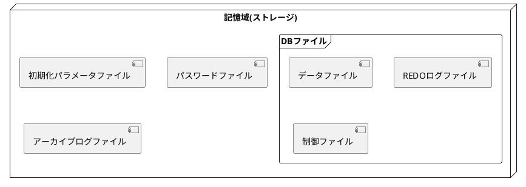

# 6.DB記憶域構造の管理
* DBを構成するファイル群について

## 1.DBファイル

### 1.DBファイルとは
* データファイル + REDOログファイル +制御ファイル = DBファイル
  * 初期化パラメータファイル、パスワードファイル、アーカイブログファイルはDBファイルに含まれない


* データファイル：表や索引などのデータが格納される
* REDOログファイル：DBに対して行われた全ての更新情報が記録される
* 制御ファイル：データファイル名、REDOログファイル名を含むDBの構成情報、管理情報が格納される
* 初期化パラメータファイル：初期化パラメータのリスト及び各パラメータの値が格納される
* パスワードファイル：SYSDBAなどの管理権限を持つユーザのパスワードを管理する
* アーカイブログファイル：REDOログファイルのコピー
### 2.データファイル
* データを格納するためのファイル
* 表、索引が格納される
  * DBでいうところの主役のようなポジション
* データファイルの構成(ファイル名、ファイル番号)は、制御ファイルで管理
### 3.REDOログファイル
* DBの更新履歴：REDOデータを記録するファイル
* オンラインREDOログファイルと呼ばれることもある
* DBに加えた全ての更新内容が記録されてる
* 直近の更新が失われるような障害から回復するために使用される
  * ex:インスタンスが異常終了した場合の障害復旧(インスタンスリカバリ)
  * ex:データファイルが破損した場合の障害復旧(メディアリカバリ)
* REDOログファイルに記録されたDBの更新履歴をもとに、更新処理を再実行することを**ロールフォワード**と呼ぶ

#### インスタンスリカバリ
* インスタンスが異常終了すると、DBファイルは一貫性が取られていない**不整合**な状態になる
* インスタンス起動時に、前回インスタンスが異常終了したことを検知すると、REDOログファイルからDBの更新履歴を読み出す
* データファイルに反映されていない更新をデータファイルに適用する
* 併せてDBファイルの整合性を回復する
* この一連の流れが**インスタンスリカバリ**
#### REDOログファイルの多重化とログスイッチ
* REDOログファイルを多重化して、1つのREDOログファイルが壊れてもDBの更新履歴が失われないようにする
* カレントグループのメンバーに空き容量がなくなると、別のロググループがカレントになる
  * これがログスイッチ
#### REDOログファイルの構成
* OracleDBには2つ以上のグループが必要
  * ログスイッチするため
* 1つのグループには1つ以上のメンバが必要
  * REDOログファイルを多重化するなら2つ以上のメンバが必要
  * 同一グループ内のメンバは同じサイズ
* REDOログファイルの構成(グループ数、メンバのファイル名)は制御ファイルで管理される
* REDOログファイルのサイズは自動的に拡張されない
### 4.制御ファイル
* DBの構成情報、管理情報を記録するファイル
  * データファイル名、REDOログファイル名などの構成情報、DB作成のタイムスタンプ、その他DBの内部動作に関わる管理情報が記録されてる
* Oracleにおいて極めて重要なので、多重化しておくべき
  * DBCAでDBCA作成した場合、デフォルトで多重化されてる
* ファイル名は、CONTROL_FILES初期化パラメータに設定する
  * 多重化した場合、CONTROL_FILESには複数のファイル名を設定する
* 既存の制御ファイルをコピー、CONTROL_FILESに新しい制御ファイル名を追加すると多重化できる
## 2.表領域
* OracleDBにおいて、表や索引などのデータを格納する格納先

### 1.表領域とオブジェクトに記憶域を割り当てる仕組み
* 表領域：データファイルを論理的にグループ化した概念
  * これを表や索引の格納先に指定する
  * 1つ以上のデータファイルをグループ化したもの
  * オブジェクトの格納先には、表領域を指定
  * オブジェクトの記憶域は、そのオブジェクトの格納先に指定された表領域を構成する、データファイルから割り当てられる
* データファイルは、固定サイズ(2KB~32KB)に分割して使用される
  * これを**データブロック**と呼ぶ
* データブロックの中にオブジェクトのデータを保管する
  * ex:表の行データは、表に対応するセグメント内のデータブロック内に保管される
* データブロックのサイズは小さいため、エクステントとしてまとめて、このエクステントをセグメントに割り当てる
* セグメントの空き領域が不足した場合、セグメントにエクステントを追加することでセグメントに空き領域を追加する
### 2.特殊な役割の表領域
* SYSTEM表領域
  * Oracleに必須の表領域
  * DBの重要な管理情報が格納される
  * 表領域名はSYSTEMで固定、変更不可能
  * 常に使用可能な状態(オンライン)である必要がある
  * SYSTEM表領域を構成するデータファイルが破損して、SYSTEM表領域が使用できなくなった場合、インスタンスが強制終了する
* SYSAUX表領域
  * Oracleに必須の表領域
  * SYSTEM表領域の補助的な役割
  * DBの管理情報が格納される
  * 表領域名はSYSAUXで固定、変更不可能
* UNDO表領域
  * UNDOセグメントという特殊なセグメントを格納するための表領域
  * 表や索引などの通常のオブジェクトのセグメントを格納できない
  * 表領域名は変更可能
    * DBCAでDBを作成した場合、"UNDOTBS1"という表領域名となる
* 一時表領域
  * 一時セグメントという特殊なセグメントを格納するための表領域
  * 表や索引などの通常のオブジェクトのセグメントを格納できない
  * 表領域名は変更可能
    * DBCAでDBを作成した場合、"TEMP"という表領域名となる
## 3.表領域の作成・拡張・削除
* SQL*Plusを使用して表領域を作成・拡張・削除する手順
### 1.表領域の作成
* CRATE TABLESPACEコマンド
```
CREATE TABLESPACE mytbls
  DATAFILE '/u01/app/oracle/mytbs01.dbf'
  SIZE 100M
  AUTOEXTEND OFF
  '/u01/app/oracle/mytbs02.dbf'
  SIZE 200M
  AUTOEXTEND ON;
```
* 永続表領域と呼ばれる
* smallfile表領域と呼ばれることもある

### 2.表領域の拡張
* 表領域の空き領域が不足した場合、表領域のサイズを拡張する
* AUTOEXTEND ONに設定されている場合、表領域の空き領域が不足するとサイズが自動的に拡張される
* 2種類の方法で拡張ができる
  * 表領域のデータファイルをリサイズして、データファイルのサイズを大きくする
  ```
  ALTER DATABASE
  DATAFILE '/u01/app/oracle/mytbs01.dbf'
  RESIZE 200M;
  ```
  * 表領域に新しいデータファイルを追加する
  ```
  ALTER TABLESPASCE mytbs
  ADD DATAFILE '/u01/app/oracle/mytbs02.dbf' SIZE 100M;
  ```
### 3.表領域の削除
* 不要になった表領域はDROP TABLESPACEコマンドで削除できる
  * 空の表領域＝オブジェクト(セグメント)が格納されていない表領域を削除する
  * 表領域にオブジェクトが格納されている場合はエラーになる
  ```
  DROP TABLESPACE mytbs;
  ```
* 表領域に格納されているオブジェクトと表領域を削除
  * 表領域を構成するデータファイルは削除されない 
  ```
  DROP TABLESPACE mytbs INCLUDING CONTENTS;
  ```

* 表領域に格納されているオブジェクトとデータファイルを削除
  ```
  DROP TABLESPACE mytbs INCLUDING CONTENTS AND DATAFILES;
  ```

### 4.bigfile表領域
* 非常に大きなサイズのDBを想定した機能
* OracleDB10gで導入された
* 従来からの表領域(smallfile表領域)は、データファイルが最大32GB
* bigfile表領域は、32TB
* bigfile表領域は、1つのデータファイルだけで構成される
  * データファイルの追加はできない
## 4.UNDO表領域と一時表領域
### 1.UNDO表領域
* 更新前の過去データ(UNDOデータ)を保管するための表領域
* 表や索引などの通常のセグメントを格納することはできない
* UNDOデータの実体＝更新される前のブロックの情報
  * UNDO表領域内のUNDOセグメントに保管される

* 下記用途として使われる
  * トランザクションのロールバック
  * 読み取り一貫性の保証
  * 一部のフラッシュバック機能
* UNDOセグメント専用の表領域
* UNDOセグメント、UNDOデータの管理はOracleにより自動的に実行される
* UNDO表領域が使用できる領域は限られている
  * 古いUNDOデータは自動的に削除される
* 稼働中のDBは、最低1つのUNDO表領域が使用可能な状態である必要がある
* 1つのDBに複数のUNDO表領域は作成できる
  * 使用可能にできるUNDO表領域は1つだけ
* 任意の名前を使用できる
  * DBCAでDB作成した場合、UNDOTBS1という名前になる
### 2.読み取り一貫性の保証
* 問い合わせ(SELECT)実行中に、他ユーザがデータを更新した際、問い合わせ開始時点のデータを参照できる機能
* UNDO表領域から変更前のデータ(=UNDOデータ)を得ることで実現する
* UNDO表領域で保管できるUNDOデータには制限があるため、大量のデータ更新が実行された場合、読み取り一貫性に必要なUNDOデータが失われることがある
  * 「読み取り一貫性エラー：ORA-01555 スナップショットが古すぎます」が発生する
  * 問い合わせは失敗する
* UNDO_RETENTION初期化パラメータに想定される問い合わせ時間よりも大きな時間を設定することでエラー防止
* UNDO表領域の自動拡張(AUTOEXTEND)を有効にすることもエラー防止

### 3.一時表領域
* メモリ上で処理ができない大量のデータを処理する場合に使用される表領域
* 表や索引などの通常セグメントを格納することはできない
* データサイズが小さく、PGAに展開できる場合はメモリ上で処理が実行される
* データサイズが大きく、PGAに展開できない場合は、一時表領域に作成される一時セグメントに展開される
  * ストレージを使って処理が実行される
  * メモリの代わりにストレージを使うため、処理速度は低下する
* Oracleにより自動的に実行されるため管理作業を行う必要は無い
* 1つ以上の一時ファイルから構成される
* 任意の名前を使用できる
* DBCAで作成すると、「TEMP」という表領域名になる